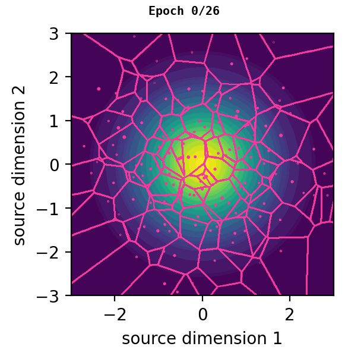

# Variational Entropy-Constrained Vector Quantization (VECVQ)
Pytorch implementation of variational entropy-constrained vector quantization as described in [Nonlinear Transform Coding](https://arxiv.org/abs/2007.03034).

Table below shows how the VECVQ models gets trained for 3 different bitrate regimes under two bivariate source distributions.

|  | Low-rate | Medium-rate | High-rate |
| :--- | :---: | :---: | :---: |
|*Normal*||||
|*Banana*||||

## Installation
In a virtual environment follow the steps below (verified on Ubuntu):
```bash
git clone https://github.com/ali-zafari/VECVQ VECVQ
cd VECVQ
python3 -m venv venv
source venv/bin/activate
pip install -U pip
pip install -r requirements.txt
```

### Training Your model
All the configurations regarding dataloader, training strategy, and etc should be set in the [`config.py`](config.py), simply followed by the command:

```bash
python train.py 
```
Model checkpoints and quantization plots will be saved under directory named `ckpt`.

## Code Structure
```
├─ models
|   ├─ compression_model.py       base compression model
|   ├─ vecvq.py                   variational entropy-constrained VQ
|
├─ banana.py                      banana probability distribution
├─ source.py                      source data (LightningDataModule)
├─ config.py                      configurations file
├─ train.py                       main file to train the vecvq model
```

## References / Citations
#### Repositories
- [TensorFlow Compression](https://github.com/tensorflow/compression/blob/master/models/toy_sources/toy_sources.ipynb): Tensorflow implementation of [Nonlinear Transform Coding](https://arxiv.org/abs/2007.03034)
- [Lossy Compression for Lossless Prediction](https://github.com/YannDubs/lossyless): Borrowed Banana distribution from [Yann Dubois](https://yanndubs.github.io/)
- [Lightning](https://github.com/Lightning-AI/lightning): Pytorch framework to avoid boilerplate code

#### Publications
```
@article{balle2020nonlinear,
  title={Nonlinear transform coding},
  author={Ball{\'e}, Johannes and Chou, Philip A and Minnen, David and Singh, Saurabh and Johnston, Nick and Agustsson, Eirikur and Hwang, Sung Jin and Toderici, George},
  journal={IEEE Journal of Selected Topics in Signal Processing},
  year={2020},
  publisher={IEEE}
}

@article{dubois2021lossyless,
  title={Lossy compression for lossless prediction},
  author={Dubois, Yann and Bloem-Reddy, Benjamin and Ullrich, Karen and Maddison, Chris J},
  journal={Advances in Neural Information Processing Systems},
  year={2021}
}
```
